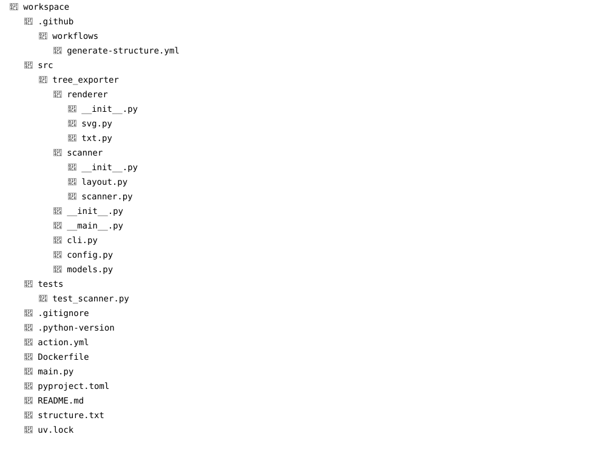

<div align="center">

# 🌳 TreeExporter

**Automatically generate beautiful repository structure diagrams from your project.**

_No more manually maintaining folder trees in your README._

<p>
    
    
</p>

</div>

---

## Why?

Keeping a repository structure up to date is surprisingly annoying.

Every time files or folders change, developers have to manually edit the tree inside the documentation:

```text
src
├── api
├── models
├── utils
└── ...
```

Which quickly becomes outdated.

**TreeExporter** scans your project and generates a clean, automatically updated visualization instead.

It can be:

- updated automatically with GitHub Actions
- used as a Python library
- used as a CLI tool
- exported to SVG or plain text

---

## 🖼 Demo

### SVG



```md

```

### Text

Look at `./structure.txt`

---

## 🚀 Features

- Repository scanning
- SVG export
- Plain text export
- Configurable excluded directories
- GitHub Actions support
- Python library API
- Fast recursive traversal

More formats are planned.

---

## Installation

WIP

---

## 💻 CLI

Generate a text tree:

```bash
tree-exporter
```

Generate SVG:

```bash
tree-exporter \
    --format svg \
    --output structure.svg
```

Exclude additional folders:

```bash
tree-exporter \
    --exclude ".venv,dist,build"
```

---

## GitHub Actions

Automatically regenerate your repository structure on a schedule or after every push.

```yaml
- uses: mrf0rtuna4/TreeExporter@master
  with:
    format: svg
    output: docs/structure.svg
```

Perfect for keeping documentation synchronized with your project.

---

## Library

TreeExporter can also be used directly from Python.

```python
from tree_exporter.config import ScanConfig
from tree_exporter.scanner import scan_repository

tree = scan_repository(
    ".",
    ScanConfig(),
)
```

---

## Roadmap

- ✅ Text export
- ✅ SVG export
- ✅ GitHub Action
- 🔄 Themes
- 🚧 Mermaid export
- 🚧 JSON export
- 🚧 PNG export
- 🚧 Custom icons
- 🚧 Ignore file support
