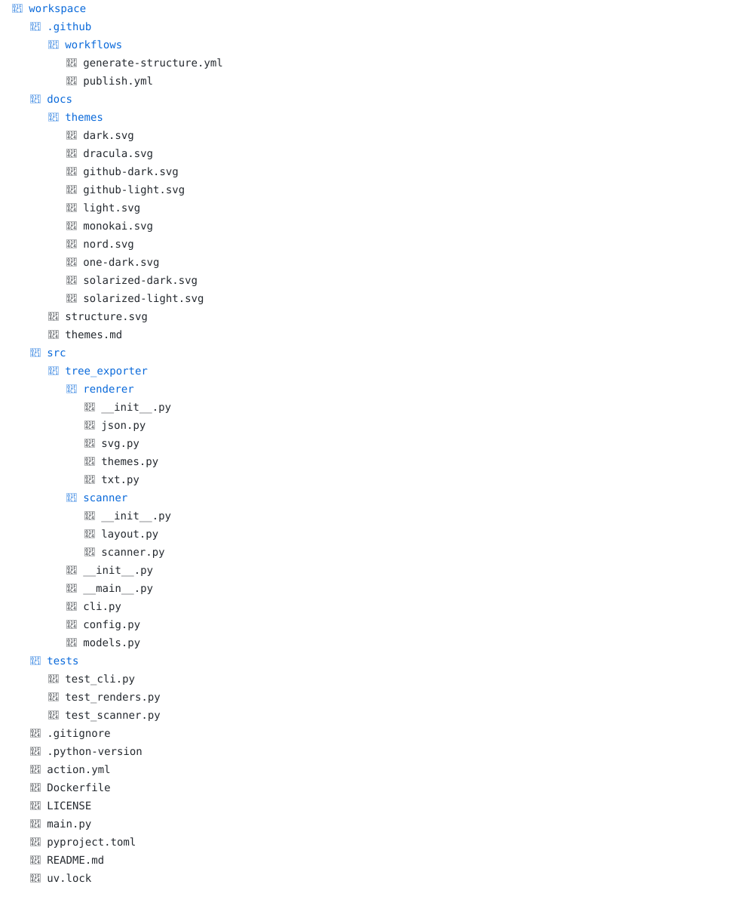
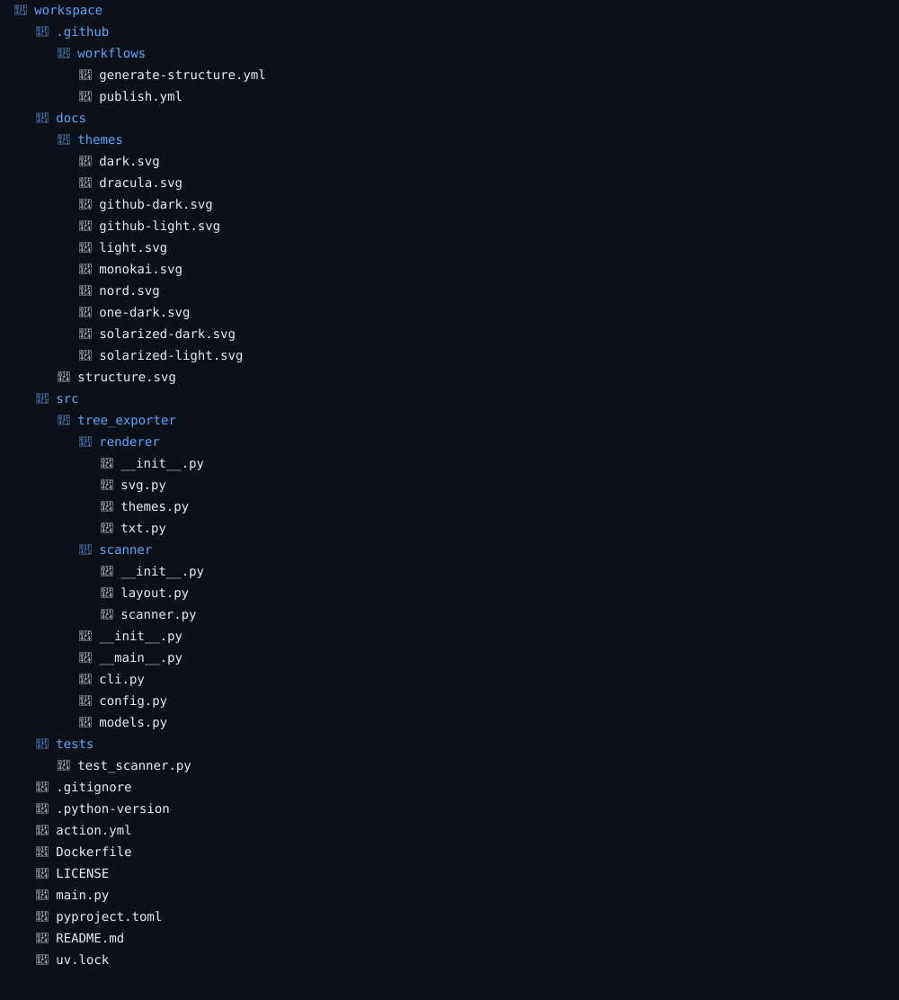
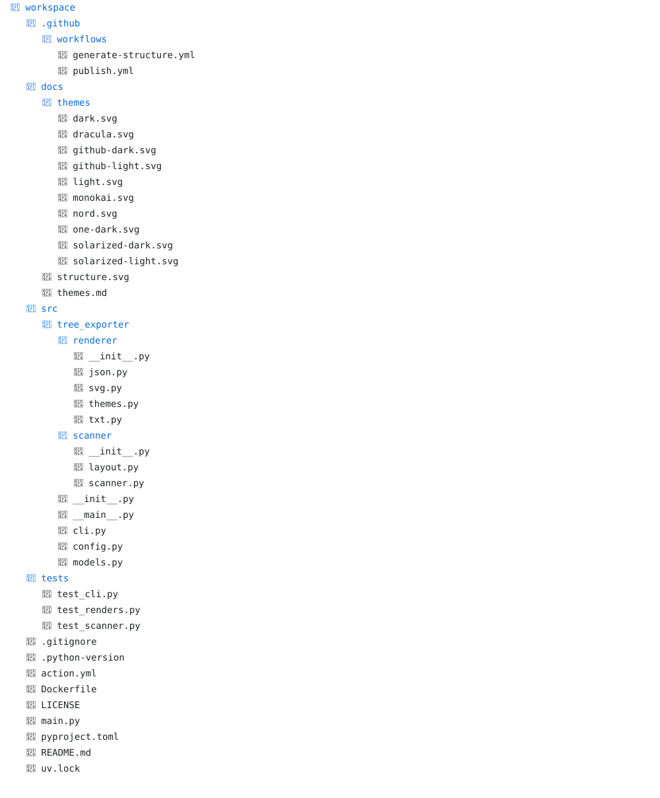
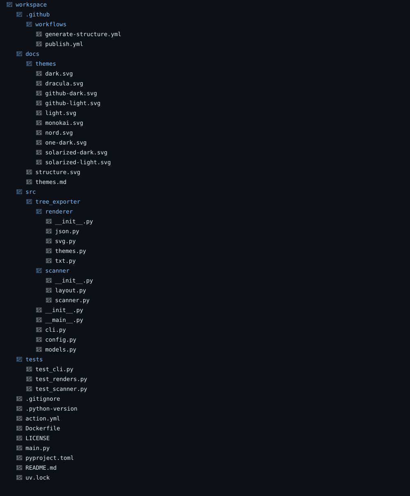
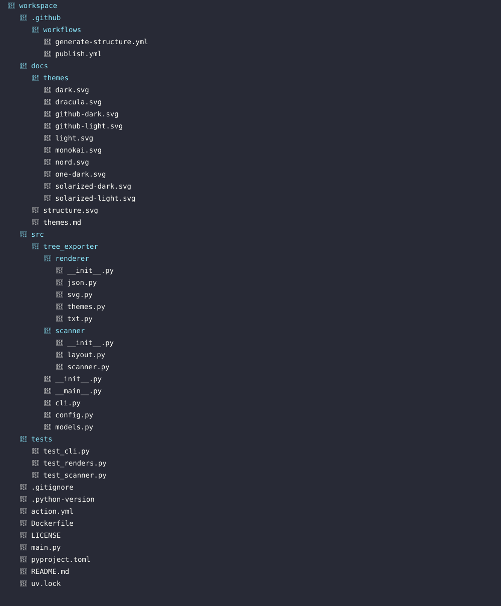
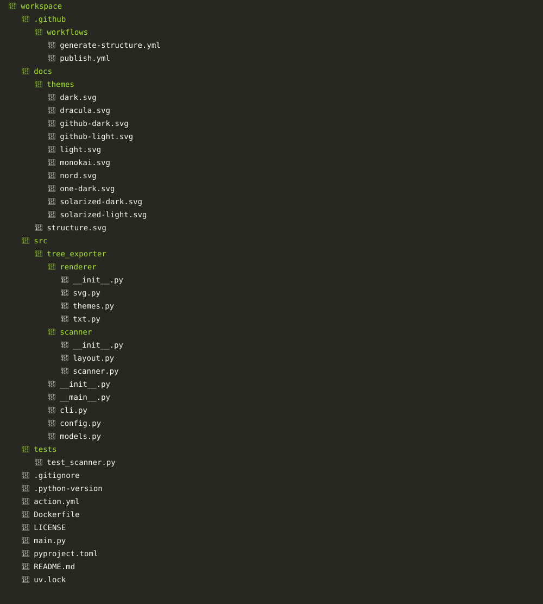
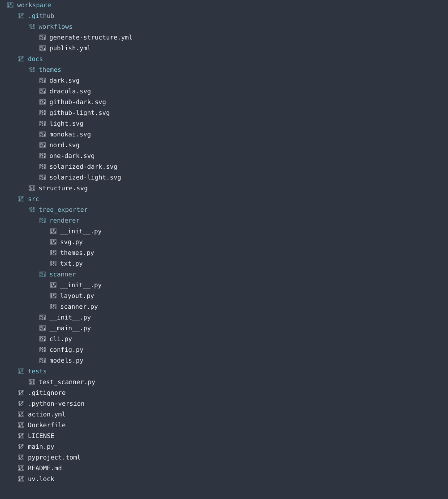
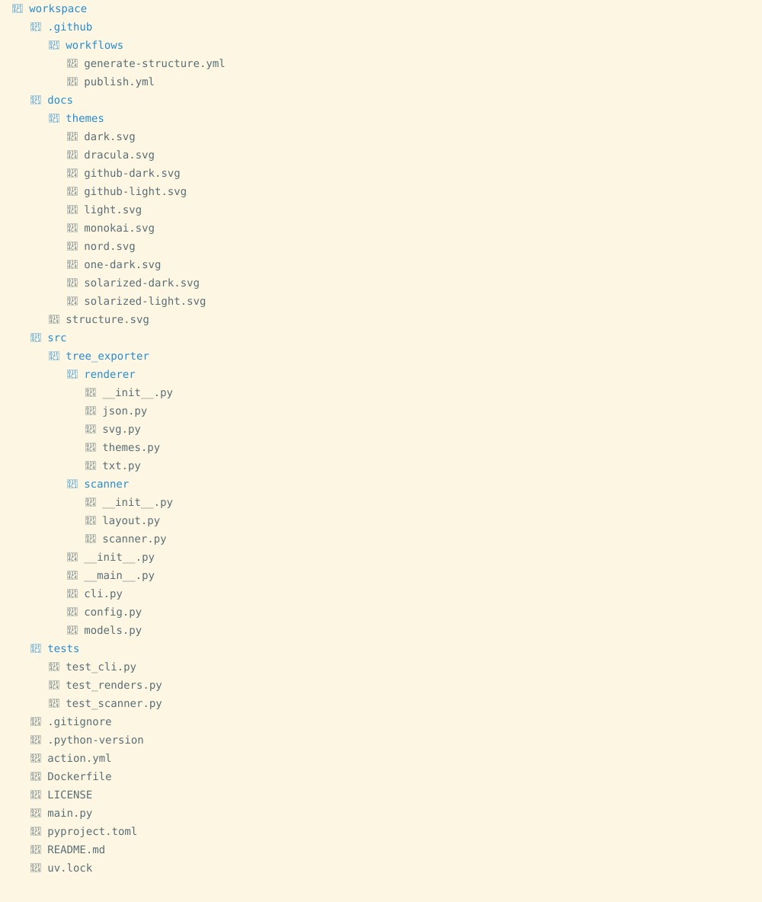
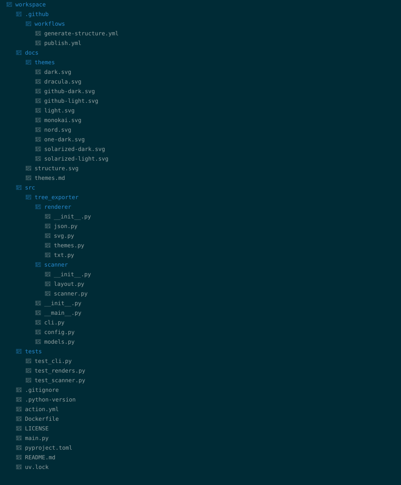
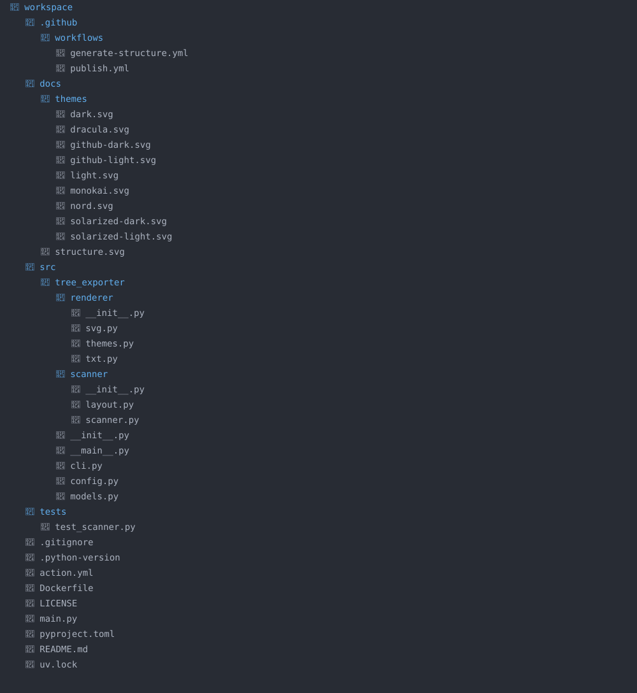

## 🎨 Themes

TreeExporter includes built-in themes for SVG output.

Choose a theme with the `--theme` CLI option or the `theme` GitHub Action input.

### Light



```bash
tree-exporter --theme light
```

### Dark



```bash
tree-exporter --theme dark
```

### GitHub Light



```bash
tree-exporter --theme github-light
```

### GitHub Dark



```bash
tree-exporter --theme github-dark
```

### Dracula



```bash
tree-exporter --theme dracula
```

### Monokai



```bash
tree-exporter --theme monokai
```

### Nord



```bash
tree-exporter --theme nord
```

### Solarized Light



```bash
tree-exporter --theme solarized-light
```

### Solarized Dark



```bash
tree-exporter --theme solarized-dark
```

### One Dark



```bash
tree-exporter --theme one-dark
```

The default theme is `light`.
